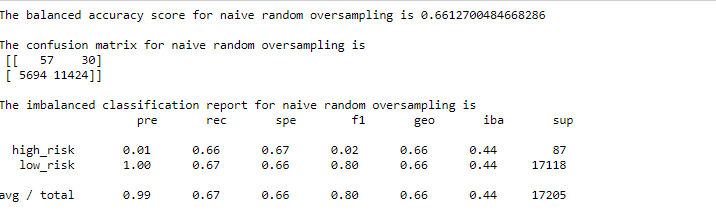
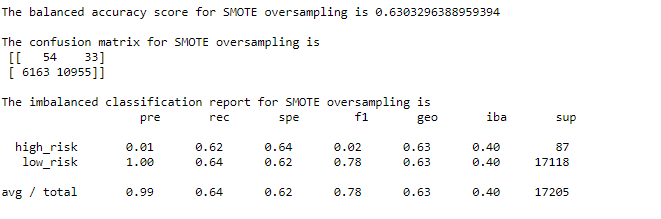
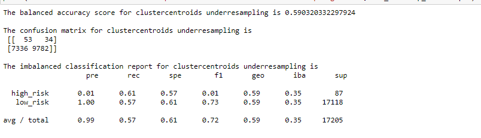
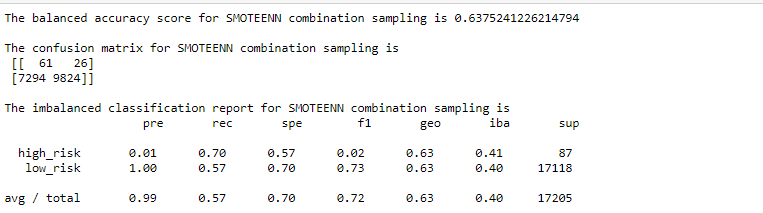
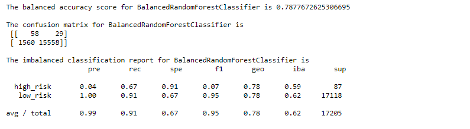
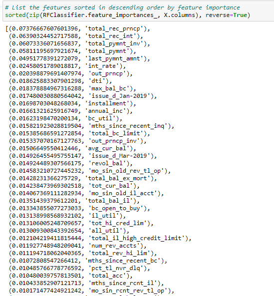
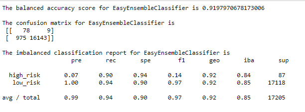

# Supervised_Machine_Learning
**Credit Risk Prediction Using  the Machine Learning Model**

## Background
The purpose of this analysis is to build and evaluate several machine
learning models to predict credit risk. Being able to predict credit risk with different machine learning algorithms can help banks and financial institutions predict anomalies, reduce risk cases, monitor portfolios, and provide recommendations on what to do in cases of fraud. 

## Objects
1. Define machine learning algorithm used in data analytics and create training and test groups from a given data set.
2. Implement and interpret the logistic regression, decision tree, random forest, and support vector machine (SVM) algorithms.
3. Compare the advantages and disadvantages of each supervised learning
algorithm and determine which supervised learning algorithm is best
used for a given data set or scenario.
4. Use ensemble and resampling techniques to to resolve class imbalance and improve model performance.

## Software/Tools/Libraries
* Jupyter Notebook 6.1.4 with numpy, pandas, pathlib, collections.   scikit-learn with train_test_split, LogisticRegression, balanced_accuracy_score, confusion_matrix,
imbalanced-learn with classification_report_imbalanced,  RandomOverSampler, SMOTE, RandomUnderSampler, SMOTEENN.

* Data Source: 
LoanStats_2019Q1.csv (https://2u-data-curriculum-team.s3.amazonaws.com/datavizonline/module_17/Module-17-Challenge-Resources.zip)

## Task 1. Use Resampling Models to Predict Credit Risk

**Objects**: Using the knowledge of the imbalanced-learn and scikit-learn libraries, evaluate three machine learning models by using resampling to determine which is better at predicting credit risk. Use the oversampling RandomOverSampler and SMOTE algorithms, and  undersampling ClusterCentroids algorithm. Using these algorithms, you’ll resample the dataset, view the count of the target classes, train a logistic regression classification. 

### Results

### Naive Random Oversampling
**Class imbalance** refers to a situation in which the existing classes in a dataset aren't equally represented. In random oversampling, instances of the minority class are randomly selected and added to the training set until the majority and minority classes are balanced.

**Accuracy score, confusion matrix, imbalanced classificatopm report**

### SMOTE Oversampling
The SMOTE Oversampling is synthetic minority oversampling technique. In SMOTE, new instances are interpolated to deal with unbalanced datasets. That is, for an instance from the minority class, a number of its closest neighbors is chosen. Based on the values of these neighbors, new values are created.

**Accuracy score, confusion matrix, imbalanced classificatopm report**

### Cluster Centroid Undersampling
Undersampling is another technique to address class imbalance. Undersampling takes the opposite approach of oversampling and the size of the majority class is decreased. In random undersampling, randomly selected instances from the majority class are removed until the size of the majority class is reduced, typically to that of the minority class.

**Accuracy score, confusion matrix, imbalanced classificatopm report**

### Summary

Herein, we compared three sampling methods, Naive Random Oversampling, SMOTE Oversampling, Cluster Centroid Undersampling,to predict the credit risk. We use the LogisticRegression classifier and evaluate the model’s performance. Looking through the different sampling models, the accuracy score of three models were 66, 63, and 59 % and the recall rate for high risk 66, 62, 51 %. All three sampling show that the precision ("pre" column) and recall ("rec" column) are high for the majority class, precision is low for the high_risk class.
These Oversampling and undersamping showed low accuracy (59-66 %) and and the sensitivity is also very low (61-66 %). We may need more accuracy model to increase the accuracy and precision for the high_risk class. 

## Task 2. Use the SMOTEENN Sampling Method

**Objects**: Use a combinatorial approach of over- and undersampling with the SMOTEENN algorithm to determine if the results from the combinatorial approach are better at predicting credit risk than the resampling algorithms from task 1.

### SMOTEENN Sampling
SMOTEENN combines the SMOTE and Edited Nearest Neighbors (ENN) algorithms. SMOTEENN is a two-step process:
1. Oversample the minority class with SMOTE.
2. Clean the resulting data with an undersampling strategy. If the two
nearest neighbors of a data point belong to two different classes, that
data point is dropped.

**Accuracy score, confusion matrix, imbalanced classificatopm report**

### Summary
Looking through the different sampling models, the accuracy score of three SMOTEENN Sampling were 64 % and the recall rate for high risk 70 %. This combinatorial sampling shows that the sensitive (recall) for high risk increases; however, the precision for the high risk class is still low (64%).  

## Task 3. Use Ensemble Classifiers to Predict Credit Risk
The concept of ensemble learning is the process of combining multiple models, like decision tree algorithms, to help improve the accuracy and robustness, as well as decrease variance of the model, and therefore increase the overall performance of the model. Using the knowledge of the imblearn.ensemble library, train and compare two different ensemble classifiers, BalancedRandomForestClassifier and EasyEnsembleClassifier, to predict credit risk and evaluate each model. Using both algorithms, resample the dataset, view the count of the target classes, train a logistic regression classifier, calculate the balanced accuracy score, generate a confusion matrix, and generate a classification report.

### Balanced Random Forest Classifying
BalancedRandomForestClassifier is one of ensemble method in which each tree of the forest will be provided a balanced bootstrap sample. Random forest is an extension of bagging that  that fits multiple models on different subsets of a training dataset, then combines the predictions from all models. The random forest involves selecting bootstrap samples from the training dataset and fitting a decision tree on each. From this Balanced Random Forest Classifying, a accuracy score, confusion matrix, imbalanced classificatopm report for the model and sorted_feature in descending_order were be generated.

**Accuracy score, confusion matrix, imbalanced classificatopm report**

 **Sorted_feature in descending_order**

### Easy Ensemble Classifying
The Easy Ensemble involves creating balanced samples of the training dataset by selecting all examples from the minority class and a subset from the majority class. Rather than using pruned decision trees, boosted decision trees are used on each subset, specifically the AdaBoost algorithm. AdaBoost works by first fitting a decision tree on the dataset, then determining the errors made by the tree and weighing the examples in the dataset by those errors so that more attention is paid to the misclassified examples and less to the correctly classified examples. A subsequent tree is then fit on the weighted dataset intended to correct the errors. The process is then repeated for a given number of decision trees.

**Accuracy score, confusion matrix, imbalanced classificatopm report**

## Summary

Looking through the two Ensemble Classifying models, BalancedRandomForestClassifier and Easy Ensemble, the accuracy score were 79 and 92 % and the recall rate for high risk 91 and 94 % which is much higher than LogisticRegression model with over- and under- and their mixed-sampling methods. The precision for the high risk class is significantly increasing with these Ensemble Classifying models from 1 to 4 and 7% and the sensitivity (recall rate) for high risk also incrases to 67 and 90%. We also rank the importance of input variables in a natural way and the squence of impartance feature are 'total_rec_prncp', 'tatal_rec_int', 'total_pymnt_inv', 'total_pymnt_amnt' etc. 

## Overall Summary

This analysis is trying to find the best model that can detect if a loan is high risk and it is important to find a model that lets the least amount of high risk loans pass through undetected. Herein, an accuracy score is not an appropriate or a meaningful performance metric; because it fails spectacularly at its job, detecting very small fraction of fraudulent transactions. However, the sensitivity (recall) for detecting a high risk is more important. After factoring recall statistics, the model recommended to use for predicting high risk loans is the Easy Ensemble Classifying model with a high value (90%). The models that scored high were:

1. Easy Ensemble Classifying (90%)
2. SMOTEENN Sampling (70%)
3. Balanced Random Forest Classifying (67%)

Another important statistic the company's profits is recall rate for low risk as it shows how many low risk loans are flagged as high risk. Looking through the different models, the ones that scored the highest were:

1. Easy Ensemble Classifying (94%)
2. Balanced Random Forest Classifying (91%)

To get a picture of the model performs in general the accurary score is also ranked. The models with the highest accuracy scores were:

1. Easy Ensemble Classify (92%)
2. Balanced Random Forest Classifying (79%)
3. Naive Random Oversampling (66%)

Overall, the ensemble classfing methos are more accurate and sensitive to to detect both highs and low-risk loan, as well as the accuracy. This is because the concept of ensemble learning is the process of combining multiple models, like decision tree algorithms, to help improve the accuracy and robustness, as well as decrease variance of the model, and therefore increase the overall performance of the model.

## Recomandation
It might be better to test the over- and under-sampling, and add the ensemble classification to increase the accuracy and sensitivity. We can also try to other types of ensemble algorism, such as GradientBoostedTree, and XGBoost models.
